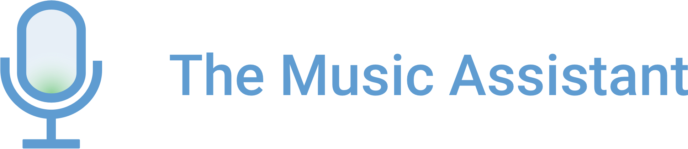

    

<h1 align="center">The Music Assistant</h1>
<h2 align="center">Florida Tech Senior Design Project 2019/2020<h2>

<h1>Team Members</h2>
<ul>
    <li>Daniel Griessler - Team Lead and Node.js Developer</li>
    <ul>
        <li><a href="https://github.com/dgriessler">GitHub</a></li>
    </ul>
    <li>Dan Levy - Web Developer</li>
    <ul>
        <li><a href="https://github.com/danlevy1">GitHub</a></li>
        <li><a href="https://www.danlevy.info">Website</a></li>
        <li><a href="https://stackoverflow.com/users/6063755/dan-levy">Stack Overflow</a></li>
    </ul>
    <li>Javier Muñoz - Performance Analysis Developer</li>
    <ul>
        <li><a href="https://github.com/JavierMunozFdez">GitHub</a></li>
    </ul>
</ul>

<h1>Motivation</h2>

The goal is to help students learn sheet music and improve their singing ability. This will be accomplished by developing an application to provide choir students with real-time, interactive feedback as they practice by analyzing pitch, duration, dynamic, tempo, rhythm, and phrasing compared to the sheet music provided by a choir instructor. The app will provide static and dynamic exercises developed based on the sheet music. The app will also provide an integrated communication tool between student peers and between students and teachers to facilitate a conductive learning environment. We focus first on choir students. Choir members are often expected to learn and practice on their own, but many members either don’t practice, don’t know how to practice, or don’t practice correctly. The impact of these circumstances is felt when the choir practices; time is wasted reviewing and teaching students their parts instead of working on integrating the choir together and focusing on the minutia of the piece. Students tend to struggle when practicing independently for reasons such as lack of training, discipline or self-confidence. Current applications exist which can analyze music and provide feedback for students by showing the discrepancy between what the student is performing and the performance that was expected in regards to pitch and duration. The applications that provide this feedback rely on a set series of exercises and abstract away the actual sheet music and multi-part harmony. They also do not provide interactive guidance to students who are struggling.

<h1>Tech Stack</h2>
<ul>
    <li>Front-End</li>
        <ul>
            <li>React</li>
            <li>Redux</li>
            <li>React Router</li>
            <li>SCSS (SASS)</li>
            <li>Babel</li>
            <li>Webpack</li>
        </ul>
    <li>Back-End</li>
        <ul>
            <li>Node.js</li>
            <li>Express</li>
            <li>AWS EC2</li>
            <li>AWS RDS</li>
            <li>MySQL</li>
        </ul>
</ul>

<h2>For more information, check out our info website <a href="https://dgriessler.github.io/The-Music-Assistant/">here</a>!</h2>
